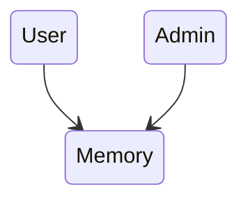

<!-- # A framework for learning programming languages -->
<div class="flex items-center">
<div class="w-[55%] mt-[60px]">
 <h1 class="text-[45px]! leading-[3.5rem]!">A framework for learning <br/>  programming languages</h1>
</div>

<div class="flex gap-2 flex-wrap  justify-items-center flex-auto w-[45%] mt-[100px]">
  
   
   
   
   
   
   
   
</div>
</div>

<div class="absolute bottom-5">
  <span class="font-400 text-neutral-500">
    <span class="font-600 text-green-600 mr-2">By Ahmed Adebisi</span> 
    <a href="https://www.entrylevel.net/events/learn-programming-as-a-beginner" >@[Entry Level]</a>
  </span>
  <div class="italic text-xs">1st October 2023</div>
</div>

---

# About me

<div>
  <div class="flex">
  <div style="width: 200px; height: 200px">
    
    </div>
  </div>
  <div class="flex-1">

Ahmed Adebisi, Software Engineer
<v-clicks>

- Previously at a fintech in Lagos called [Nomba](https://nomba.com), now i work at a startup called [Qatalog](https://qatalog.com) in London
- My website [adebisiahmed.dev](https://adebisiahmed.dev)
- Often build hobby projects in web & mobile animations, Algorithms, and (more recently) Golang.
- Love playing and watching Football (Soccer) 🔵 🔴
</v-clicks>

  </div>

</div>

---

# Your Goal for learning the language

<ul>
<li>To build a specific app e.g Java/Kotlin for Android Dev 📱</li>
<v-click> <li>To learn  a new paradigm or a different way of thinking e.g Haskell for FP </li> </v-click>
<v-click> <li>New opportunities - Get a job, Open source</li> </v-click>
<v-click> <li>Pivoting to different areas in tech</li>
 </v-click>
 <v-click>
 <li>To be a generalist</li>
 </v-click>
</ul>

---

# Start with the basics

<ul>
<li>Every language has its commonalities, of course, with slight variations in syntax</li>
<v-click><li>DataTypes supported in the language</li>
```go
integers, booleans, strings, floats, doubles, longs
```
</v-click>
<v-click>
 <li>Variable and Constants Declarations e.g in Golang</li>
```go
// Golang
var name string = "Mark" 
```
```python
# Python
name = "Mark" 
```
 </v-click>
<v-click> <li>Control flow: if/else, for loops, while loops, switch statements</li>
```python
 age = 20
 if age >= 18:
    print("I am an adult")
```
</v-click>
 <v-click>
 <li>Functions</li>
```go
func add(x int, y int) int {
	return x + y
}
```
 </v-click>
</ul>

---

# Learn language collections

<v-clicks>

- Sets

```python
# add, remove
set = set()
```

- Lists

```java
// add, get, set, remove clear
ArrayList<String> cars = new ArrayList<String>();
```

- Maps or Dictionaries

```python
# keys, values, items, get, pop, popitem, clear, copy
classSores = {"alex": 60, "maria": 89, "jax": "100"}
```

- Queues

```python
# popleft, append, use the index to access the first element
queue = deque()
```

</v-clicks>

---

# Learn language collections

<v-clicks>
- Stacks

```java
// push, pop, peek, empty
Stack<String> animals= new Stack<>();
```

- Heaps (Priority Queue)

```java
// add, poll
PriorityQueue<Integer> integerQueue = new PriorityQueue<>();
```

</v-clicks>

---

# Learn how to store complex types

<v-clicks>

- This is an aggregation of simple data types that characterizes an entity

- This is usually expressed in classes / structs

```go
// Golang
type User struct {
    name string
    age  int
}

```

```python
# Python
class User:
  def __init__(self, name, age):
    self.name = name
    self.age = age

  def printName(self):
    print("Hello my name is " + self.name)

  def __str__(self):
    return f"{self.name}({self.age})"
```

</v-clicks>

---

# Copy by Value vs Copy by Reference

<v-clicks>

- When working with data in programming they need to be passed around, copies or duplicated. Knowing how data can be muted will save you a lot of headaches. e.g values passed into a function,. Primitive type vs complex types.

- copy by value

```js
// Javascript
let x = 10;
let y = 20;
let a = x;
let b = y;
// 10, 10, 20, 20
console.log(x, a, y, b);
x = 5;
y = 30;
// 5, 10, 30, 20
console.log(x, a, y, b);
```

</v-clicks>

---

# Copy by Value vs Reference

<v-clicks>

- Copy by reference

```js
// Javascript
let user = { firstName: "Ryan", lastName: "Max" };
let admin = user;
admin.firstName = "Matt";
// {firstName: 'Matt', lastName: 'Max'} {firstName: 'Matt', lastName: 'Max'}
console.log(admin, user);
```



- solution is to make a copy

```js
// Javascript
let user = { firstName: "Ryan", lastName: "Max" };
let admin = { ...user };
admin.firstName = "Matt";
// {firstName: 'Matt', lastName: 'Max'} {firstName: 'Ryan', lastName: 'Max'}
console.log(admin, user);
```

</v-clicks>

---

# Learn language specific concepts

<v-clicks>

- Golang - go routines

- Python - Comprehensions

```python
# python
squares = [i * i for i in range(11)]
```

```python
# python
squares = []
for i in range(11):
  squares.append(i * i)
```

- Rust - Pattern Matching

```rust
// rust
let x = 1;
let message = match x {
    0 | 1 => "not many",  // check if matches either to 0 or 1
    2..=9 => "a few",     // check if its in a range of `[2, 9]`
    10..15 => "too many", // check if its in a range of `[10, 15)`
    _ => "lots of many", // else clause, if neither of the cases matches then "lots of
};
```

</v-clicks>

---

# More General/Advanced Concepts

<v-clicks>

- Read data from StdIn and Write to StdOut
- Reading and writing files (.txt, .json)
- Generics
- Making Http requests
- String Parsing
- Error Handling

</v-clicks>

---

# Non Language specific tips

<v-clicks>

- Pace yourself and work on exercises along the way to reinforce your learning

- Keep the docs on your phone, redirect some social media time into reading the docs. Knowing what’s possible or not in the language can help you write better code

- Practice problem solving in the language. Advent of code, Leetcode to mention a few

- Looking up other people's solution to the same problems

- Stay up to date with the changes in the language. Check Github issues to see proposals, check blogs/videos for update in the language

- Don’t be satisfied with the first solution that works? Ask yourself how to improve the solutions you come up with or use google

- Try project based learning, they expose your knowledge gaps and are an easy way to level up your skills

- Build projects that are personal to you

- Re-build projects you have worked on with other languages

</v-clicks>

---

# References & Resources

- [Codecademy](https://www.codecademy.com/resources/blog/when-to-learn-new-programming-language/)
- [Programiz](https://www.programiz.com)
- [How To Learn A New Programming Language](https://www.youtube.com/watch?v=E8cM12jRH7k&ab_channel=ThePrimeagen)
- [App ideas](https://github.com/florinpop17/app-ideas)

---

<h1 class="text-[45px]! leading-[3.5rem]! text-center ">Questions?</h1>
<div class="flex items-center justify-center h-[60%] pt-[40px]">
   
</div>

---

<h1 class="text-[45px]! leading-[3.5rem]! text-center ">Connect with me</h1>
<div class="flex items-center justify-center h-[60%] pt-[40px]">
   
</div>

<div>
</div>
